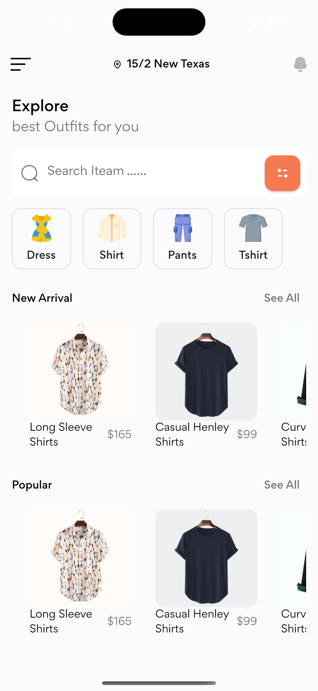
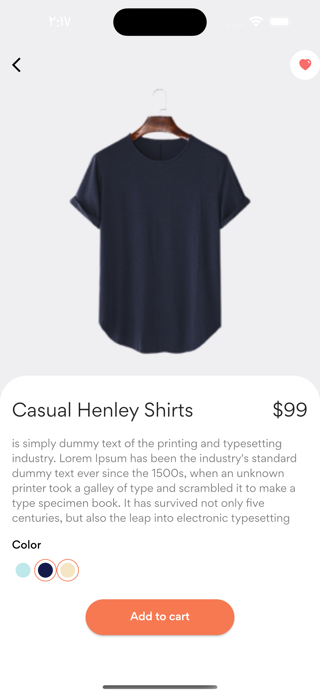
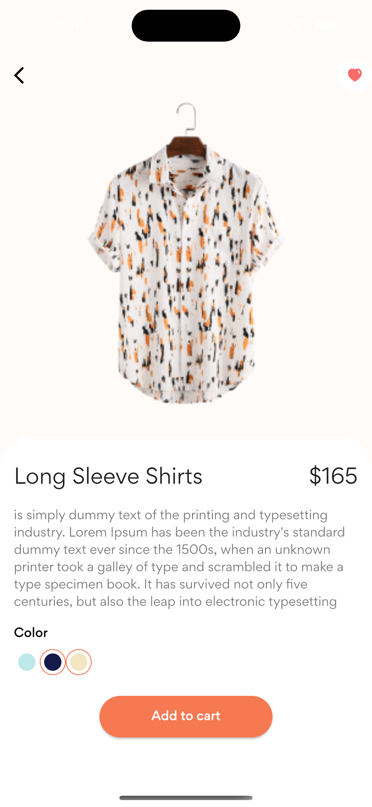

# Flutter Shop

This project for managment budget. It was build for a Capstone Project for the Microverse Ruby on Rails module.

## Built With

- Flutter

## Video 
[video](https://drive.google.com/file/d/1FylBdBtxG_MClZ67UJV-sBaKnrUfYc9_/view?usp=sharing)

## Screen 

## Getting Started

Download the ZIP from this [Link](https://github.com/mustabbas/Flutter-Shop.git), or run the following git command to clone the files to your machine:

- git clone https://github.com/mustabbas/Flutter-Shop.git
- Open the cloned folder on the IDE of your choice
- run `flutter run`

## Author

👤 **MUSTAFA ABBAS**

- GitHub: [@githubhandle](https://github.com/mustabbas)
- LinkedIn: [LinkedIn](https://www.linkedin.com/in/mustabbas/)

## 🤝 Contributing

Contributions, issues, and feature requests are welcome!

Feel free to check the [issues page](https://github.com/mustabbas/Flutter-Shop/issues).

## Show your support

Give a ⭐️ if you like this project!

## Acknowledgments
I would like to thank this channel that learn me to do this app [ TheFlutterWay,](https://www.youtube.com/@TheFlutterWay),

## 📝 License

This project is [MIT](./MIT.md) licensed.

